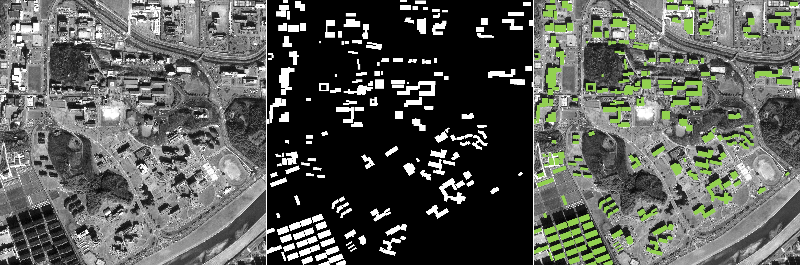

# Building-Extraction-Modified-ResUnet
Urban building extraction in Daejeon region using Modified Residual U-Net (Modified ResUnet) and applying post-processing.

# Environment Requirements
Keras

Data Sample:

Sept. 2019

Tran Le Anh

# Clone & Update

Transfer the code using pytorch deep learning model.

Mar.2020
Jifei Wang